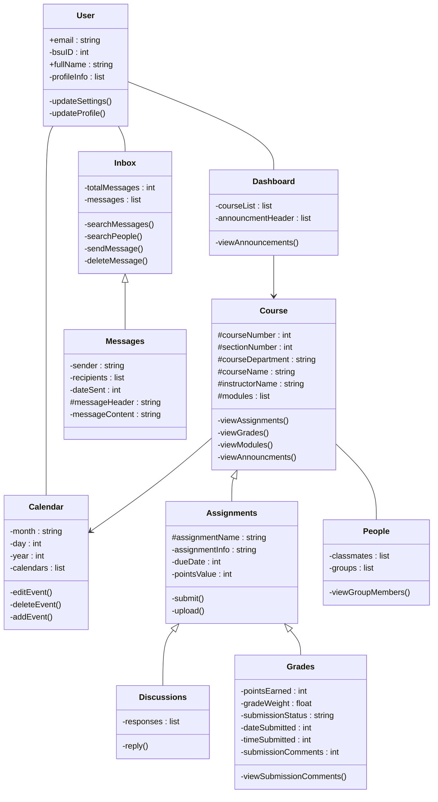

```mermaid
classDiagram
    User -- Dashboard
    User -- Calendar
    User -- Inbox
    Dashboard --> Course
    Course --> Calendar
    Course <|-- Assignments
    Course -- People
    Assignments <|-- Discussions
    Assignments <|-- Grades
    Inbox <|-- Messages
    class User{
        +email : string
	    -bsuID : int
        +fullName : string
        -profileInfo : list<string>
        -updateSettings()
        -updateProfile()
    }
    class Inbox {
        -totalMessages : int
        -messages : list<string>
        -searchMessages()
        -searchPeople()
        -sendMessage()
        -deleteMessage()
    }
    class Messages {
        -sender : string
        -recipients : list<string>
        -dateSent : int
        #messageHeader : string
        -messageContent : string
    }
    class Calendar {
        -month : string
        -day : int
        -year : int
        -calendars : list<string>
        -editEvent()
        -deleteEvent()
        -addEvent()
    }
    class Dashboard {
        -courseList : list<string>
        -announcmentHeader : list<string>
        -viewAnnouncements()
    }
    class Course {
        #courseNumber : int
        #sectionNumber : int
        #courseDepartment : string
        #courseName : string
        #instructorName : string
        #modules : list<string>
        -viewAssignments()
        -viewGrades()
        -viewModules()
        -viewAnnouncments()
    }
    class People {
        -classmates : list<string>
        -groups : list<string>
        -viewGroupMembers()
    }
    class Assignments {
        #assignmentName : string
        -assignmentInfo : string
        -dueDate : int
        -pointsValue : int
        -submit()
        -upload()
    }
    class Discussions {
        -responses : list<string>
        -reply()
    }
    class Grades {
        -pointsEarned : int
        -gradeWeight : float
        -submissionStatus : string
        -dateSubmitted : int
        -timeSubmitted : int
        -submissionComments : int
        -viewSubmissionComments()
    }
```